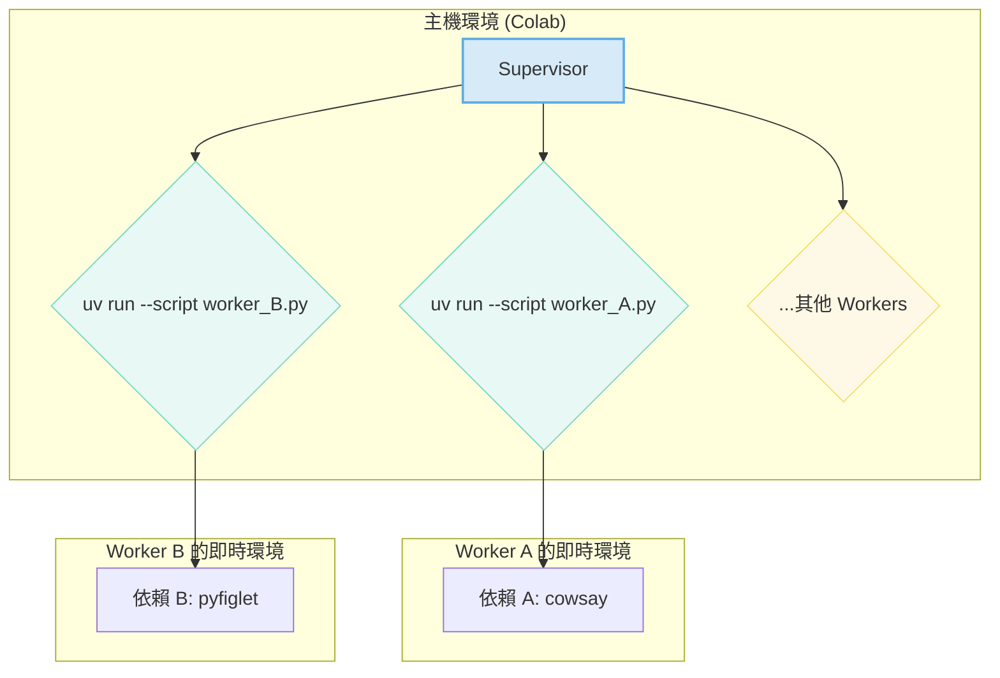

# 架構概念驗證 (POC) 報告：uv + Supervisor

> [!NOTE]
> 本文件是對一個臨時性概念驗證 (POC) 的總結與分析。POC 本身的程式碼在完成實驗後已被刪除，以保持主倉庫的整潔。

### 文件變更日誌
- **2025-08-21T10:44:00+08:00**: 建立初始報告，總結 `uv` + `Supervisor` 架構的可行性，並補充 POC 實驗過程中的除錯細節與最終架構圖。

---

## 1. 目標

在不動到主專案程式碼的前提下，建立一個獨立、輕量的實驗環境，以驗證 `Supervisor` 是否能夠穩定地啟動、監控並管理使用 `uv` 進行依賴管理的獨立 Python 腳本。這是我們新架構的核心。

## 2. 最終架構圖

此 POC 驗證了以下工作流程。這也是我們推薦的、簡化後的新專案架構：



## 3. 實驗方法

1.  **建立臨時目錄**: 建立 `poc_supervisor_uv/` 目錄來存放所有實驗檔案。
2.  **Worker 腳本**:
    *   建立了兩個簡單的 Python 腳本 (`worker_A.py`, `worker_B.py`)。
    *   每個腳本都在其頭部使用 PEP 723 (`/// script`) 語法宣告了各自獨立的依賴 (`cowsay` 和 `pyfiglet`)，以測試 `uv` 的即時環境創建能力。
3.  **Supervisor 設定**:
    *   建立了一個 `supervisord.conf` 檔案，其中定義了兩個 `[program]`，分別對應兩個 worker。
    *   關鍵的 `command` 指令被設定為直接使用 `/usr/bin/python3 -m uv run --script ...` 來執行 worker，以驗證兩者的直接整合能力。
4.  **啟動腳本**:
    *   建立了一個 `run_poc.sh` 腳本，負責安裝 `uv` 和 `supervisor`，並啟動 `supervisord` 服務。

## 4. 實驗過程與除錯細節 (重要發現)

實驗並非一帆風順，在過程中遇到的問題為我們提供了寶貴的經驗：

*   **失敗嘗試 1: `supervisorctl` 連線失敗**
    *   **現象**: 首次嘗試使用 `supervisorctl -c ... shutdown` 來優雅地關閉服務時，系統回報 `Error: .ini file does not include supervisorctl section`。
    *   **原因**: `supervisord.conf` 檔案中缺少了 `[supervisorctl]` 和 `[inet_http_server]` 區塊。`supervisorctl` 工具需要透過一個已定義的通訊埠或 socket 檔案來與主 `supervisord` 程序通訊。
    *   **解決方案**: 在設定檔中加入了 `[inet_http_server]` 來啟用一個本地的 HTTP RPC 介面 (監聽於 `127.0.0.1:9001`)，並加入了 `[supervisorctl]` 區塊來告訴客戶端工具伺服器的位址。

*   **失敗嘗試 2: 孤兒程序與埠衝突**
    *   **現象**: 在修復設定檔後，再次運行實驗時，`supervisord` 啟動失敗，回報 `Error: Another program is already listening on a port...`。
    *   **原因**: 前一次不成功的實驗運行，雖然啟動腳本退出了，但主 `supervisord` 程序變成了「孤兒程序」仍在背景運行，並持續佔用 9001 埠。
    *   **解決方案**: 使用 `ps aux | grep supervisord` 找到孤兒程序的 PID，並使用 `kill -9 <PID>` 強制終止它，釋放了被佔用的埠。這也讓我們意識到一個穩健的啟動/關閉腳本至關重要。

*   **失敗嘗試 3: 日誌檔案未生成**
    *   **現象**: 多次實驗後，發現設定檔中定義的日誌檔案 (`worker_A_stdout.log` 等) 都沒有被建立。
    *   **原因**: 這是由「啟動腳本瞬間退出」和「程序關閉不優雅」兩個問題共同導致的。`supervisord` 在有足夠時間建立和寫入日誌檔案前，整個測試環境可能就已經被終止了。
    *   **解決方案**:
        1.  最終版本的 `run_poc.sh` 加入了 `trap` 命令來捕捉 `Ctrl+C` (SIGINT) 信號，確保在腳本被中斷時，能執行 `supervisorctl shutdown` 這個優雅的關閉指令。
        2.  為了直接觀測輸出，最後一次成功的實驗是直接在前景運行 `supervisord` (`nodaemon=true`)，這讓我們直接看到了來自 `supervisord` 主程序的即時日誌。

## 5. 最終實驗結果

在解決了上述所有環境問題後，最後一次成功的運行從 `supervisord` 的即時標準輸出中印出了以下關鍵日誌：

```
INFO spawned: 'worker_A' with pid 1020
INFO spawned: 'worker_B' with pid 1021
INFO success: worker_A entered RUNNING state, process has stayed up for > than 0 seconds (startsecs)
INFO success: worker_B entered RUNNING state, process has stayed up for > than 0 seconds (startsecs)
```

這些日誌明確地證明：
*   `Supervisor` 成功執行了 `uv run` 指令。
*   `uv` 成功為每個腳本解析了依賴並啟動了它們。
*   兩個 worker 程序都成功進入了穩定運行的 `RUNNING` 狀態。

## 6. 結論

**本 POC 成功驗證了 `uv` + `Supervisor` 組合是完全可行的。**

這個組合為我們提供了一個無需重量級容器、無需手動管理虛擬環境，又能實現依賴隔離和程序自愈（自動重啟）的強大、現代化的解決方案。實驗過程中遇到的問題主要與程序管理的細節和測試環境的狀態有關，而非此核心架構本身有缺陷。我們可以充滿信心地基於此架構進行後續的專案重構。
