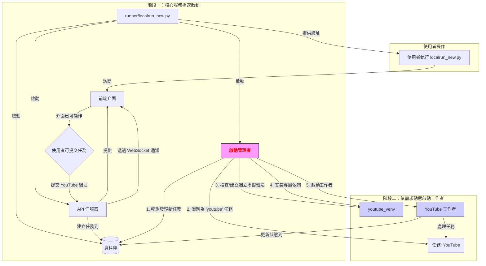

# 架構研究：優化啟動順序與工作者動態管理

> **最後更新 (Last Updated):** 2025-08-19T07:45:00Z

## 1. 總結 (Executive Summary)

本文件旨在研究並提出一個優化的系統啟動架構，以解決當前啟動時間過長、資源利用率不高的問題。核心目標是讓使用者在 30 秒內看到可操作的前端介面，並能提交任務。

**建議的核心方案**：採用「分階段啟動」結合「動態工作者管理者」的模式。先啟動資料庫、API 等核心服務，讓前端快速上線。然後由一個常駐的「管理者」程序，根據資料庫中的任務佇列，動態地為每個工作者建立獨立的虛擬環境，並在需要時才啟動它們。

此方案能最大化提升使用者體驗、顯著降低閒置資源的消耗，並透過虛擬環境隔離來提高系統的穩定性與可維護性。

## 2. 核心問題分析 (Core Problem Analysis)

當前的 `localrun_new.py` 腳本在設計上存在以下幾個挑戰：

1.  **啟動時間過長 (Long Startup Time)**：腳本需要在啟動時安裝 *所有* 服務的依賴、建置前端，並一次性啟動 *所有* 背景工作者。這導致使用者需要等待很長時間才能看到網頁。
2.  **資源浪費 (Resource Waste)**：像 `run_transcription_worker.py` 這樣的工作者，即使在沒有任務時，也會因為載入了大型 AI 模型而持續佔用大量的記憶體 (RAM) 和 CPU 資源。
3.  **潛在的依賴衝突 (Potential Dependency Conflicts)**：所有 Python 服務共享同一個虛擬環境。未來如果不同的工作者需要不同版本的函式庫，將會引發難以解決的依賴衝突。

## 3. 建議架構：分階段啟動與動態工作者管理者



為了應對上述挑戰，我們提出以下兩階段的啟動流程：

### 階段一：核心服務啟動 (Core Service Startup)

此階段的目標是「極速呈現」。主啟動腳本 (`runner/localrun_new.py`) 的職責將大幅簡化，只負責啟動系統運作所必需的核心元件：

1.  **啟動資料庫** (例如 PostgreSQL)。
2.  **啟動後端 API 伺服器** (`run_api_server.py`)。
3.  **啟動前端服務** (透過 `bun run dev` 或類似指令)。
4.  **啟動新的「啟動管理者工作者」** (`run_startup_manager_worker.py`)。

在此階段完成後，前端網頁應已可用，使用者可以立即開始瀏覽頁面、提交任務。整個過程應可在 30 秒內完成。

### 階段二：依需求動態啟動工作者 (On-Demand Worker Startup)

此階段由「啟動管理者工作者」全權負責，它是一個輕量級的常駐程序，持續監控任務佇列。

1.  **監聽任務**: 管理者會定期查詢資料庫中的任務表 (可視為一個任務佇列)。
2.  **環境準備**: 當一個新的、需要特定工作者 (例如 `transcription`) 的任務出現時，管理者會：
    a. 檢查對應的獨立虛擬環境 (例如 `runner/venvs/transcription`) 是否存在。
    b. 若不存在，則使用 `uv` 為其建立一個全新的虛擬環境：`uv venv runner/venvs/transcription`。
    c. 接著，使用該環境的 `uv` 安裝專屬的依賴：`uv pip install -r requirements/requirements_transcription.txt`。
3.  **啟動工作者**: 環境準備就緒後，管理者會使用該虛擬環境的 Python 解譯器來啟動工作者程序：`runner/venvs/transcription/bin/python workers/run_transcription_worker.py`。
4.  **任務完成後**: 工作者可以設計成處理完單一任務後自動退出，或持續運行一段時間後因不活動而退出，以釋放資源。管理者會持續監控，並在下次需要時再次啟動它。

## 4. 技術方案選型 (Technology & Tooling Choices)

### 工作者啟動與管理

*   **推薦方案：自定義 Python 腳本 (使用 `subprocess` 模組)**
    *   **描述**：由我們自己編寫的 `run_startup_manager_worker.py`，使用 Python 內建的 `subprocess` 模組來呼叫 `uv` 指令並啟動其他工作者腳本。
    *   **優點**：
        *   **極致靈活**：可以完美實現我們所需的複雜 logique (檢查環境、安裝依賴、啟動程序)。
        *   **無外部依賴**：除了 `uv` 本身，無需為管理者引入新的複雜套件。
        *   **跨平台**：`subprocess` 在 Windows、Linux 和 macOS 上行為一致。
        *   **輕量級**：方案本身非常簡單，不會增加系統負擔。
    *   **結論**：最適合我們需求的方案。

*   **備選方案：任務佇列套件 (如 `Celery`, `RQ`)**
    *   **描述**：這些是功能強大的分佈式任務佇列系統。
    *   **優點**：提供了許多進階功能，如重試、任務排程、結果追蹤等。
    *   **缺點**：
        *   **過於複雜 (Overkill)**：需要引入一個獨立的訊息中間件 (如 Redis)，增加了系統的部署和維護複雜度。
        *   **不直接解決環境隔離**：它們主要管理 *任務* 的分發，而不是 *執行環境* 的建立。我們仍需自行處理虛擬環境的部分。
    *   **結論**：對於目前的需求來說，殺雞用牛刀。

### 虛擬環境隔離

*   **推薦工具：`uv`**
    *   **描述**：一個用 Rust 編寫的極速 Python 套件安裝與解析器。
    *   **優點**：
        *   **速度極快**：建立環境和安裝依賴的速度遠超傳統的 `venv` + `pip`。
        *   **現代化**：提供簡潔的 API 和優秀的使用者體驗。
        *   **符合您的要求**：這是您明確指定的工具。
    *   **結論**：最佳選擇。

## 5. 結論與後續步驟

我們應採用**自定義 Python 管理者腳本**搭配 **`uv`** 和 **`subprocess`** 的組合來實現所述的動態架構。

**後續開發步驟建議**：

1.  **拆分依賴**：將主 `requirements.txt` 拆分為 `requirements_api.txt`, `requirements_youtube.txt`, `requirements_transcription.txt` 等多個檔案。
2.  **開發管理者**：實作 `run_startup_manager_worker.py` 的核心邏輯。
3.  **改造主啟動器**：修改 `runner/localrun_new.py`，讓它只啟動核心服務和管理者。
4.  **調整測試**：修改 `test.py` 以適應新的啟動流程。

## 6. 架構方案深度探討與最終決策 (2025-08-19)

在初步的研究之後，我們進行了更深入的討論，並決定採用一個更具體、更易於管理的技術棧來取代原先的「自定義 Python 管理者腳本」方案。

**最終決策：採用 `Huey` + `SQLite` + `Circus` 的組合。**

*   **任務佇列引擎 (`Huey`)**: 一個輕量級但功能強大的任務佇列，負責管理任務的派發、執行與重試。
*   **佇列後端 (`SQLite`)**: 作為 `Huey` 的後端，使用單一資料庫檔案來儲存任務，無需安裝額外的服務如 Redis，極大地簡化了本地開發環境。
*   **流程管理工具 (`Circus`)**: 一個成熟的 Python 流程管理器，負責監控和管理所有獨立的工作者程序 (Huey Consumer)，確保它們穩定運行並在失敗時自動重啟。

這個組合方案不僅實現了動態啟動、資源隔離的目標，還透過引入成熟的工具簡化了開發和維護的複雜度。

### 6.1. Huey 佇列後端比較：`Redis` vs. `SQLite`

為了驗證 `SQLite` 作為後端的可行性，我們進行了詳細的比較：

| 特性 | `Redis` 後端 | `SQLite` 後端 | 結論 |
| :--- | :--- | :--- | :--- |
| **設定複雜度** | **高**：需要安裝、設定並運行一個獨立的 Redis 服務。 | **極低**：無需任何額外服務，佇列只是一個資料庫檔案。 | `SQLite` 在簡潔性上**大獲全勝**。 |
| **效能** | **極高**：基於記憶體，速度飛快。 | **良好**：基於檔案，但對於我們絕大多數任務，瓶頸在於任務本身（如 AI 運算），而非佇列讀寫。 | `SQLite` 的效能**完全足夠**我們目前和可預見的未來使用。 |
| **並行處理** | **優秀**：專為高併發設計。 | **夠用**：有寫入鎖，但對於我們每個工作者只有少數實例的情境，幾乎不會遇到瓶頸。 | 兩者都可滿足需求，但 `Redis` 在極端情況下更具優勢。 |
| **未來擴充** | **容易**：可輕易擴展至多台伺服器的分散式系統。 | **困難**：僅限於單機使用。 | 如果未來需要跨伺服器部署，遷移到 `Redis` 是必要的。但目前來看，這不是我們的首要考量。 |

**分析結論**: 對於當前的單機、本地開發環境，`SQLite` 提供的極致簡潔性遠勝於 `Redis` 帶來目前用不到的「超高效能」和「分散式能力」。

### 6.2. 最終建議架構：`Circus` + `Huey`

取代原先由一個自定義 Manager 腳本來管理 `subprocess` 的方案，我們改用 `Circus` 來管理多個 `Huey` 消費者 (Consumer) 程序。

```mermaid
graph TD
    subgraph "使用者操作"
        U[使用者執行 circusd circus.ini]
    end

    subgraph "核心服務 (由 Circus 管理)"
        C[Circus] -- "啟動並監控" --> API[API 伺服器]
        C -- "啟動並監控" --> DB[(SQLite 資料庫)]
        C -- "啟動並監控" --> H_YT[<font color=blue>YouTube Huey Consumer</font>]
        C -- "啟動並監控" --> H_TR[<font color=green>Transcription Huey Consumer</font>]
        C -- "啟動並監控" --> H_HW[<font color=orange>硬體監控 Huey Consumer</font>]
    end

    subgraph "任務處理流程"
        User[使用者] -- "1. 提交 YouTube 網址" --> API
        API -- "2. 建立任務到" --> Q[Huey 佇列 (sqlite.db)]
        H_YT -- "3. 取得 'youtube' 任務" --> Q
        H_YT -- "4. 處理下載" --> Task_YT{下載影片}
        Task_YT -- "5. 建立新任務到" --> Q
        H_TR -- "6. 取得 'transcription' 任務" --> Q
        H_TR -- "7. 處理轉錄" --> Task_TR{轉錄音檔}
    end

    subgraph "硬體監控 (週期性任務)"
        H_HW -- "1. 每 5 秒執行一次" --> Task_HW{psutil 收集資訊}
        Task_HW -- "2. 推送數據" --> API_WS[API WebSocket]
        API_WS -- "3. 廣播給" --> FE[前端介面]
    end

    style C fill:#f9f,stroke:#333,stroke-width:2px
```

**運作流程**:
1.  **統一啟動**: 開發者執行 `circusd circus.ini`。
2.  **服務管理**: `Circus` 根據設定檔，啟動 API 伺服器、以及每種任務類型對應的一個 `huey_consumer.py` 程序。
3.  **任務分派**: API 收到請求後，將任務（例如 `download_video`）放入 `Huey` 佇列（一個 `huey.db` 檔案）。
4.  **任務執行**: 對應的 `Huey` 消費者（例如 YouTube Consumer）會從佇列中取得任務並執行。執行過程中可以再產生新的任務（例如轉錄任務）。
5.  **獨立與隔離**: 每個消費者都是一個獨立的作業系統程序，由 `Circus` 負責監管，實現了完美的資源和環境隔離。

### 6.3. 新增工作者：硬體監控
為了讓前端能顯示系統狀態，我們將新增一個「硬體監控工作者」。

*   **實現方式**: 這將是一個由 `Huey` 管理的**週期性任務** (`periodic_task`)。
*   **執行內容**:
    1.  設定為每 5 秒執行一次。
    2.  使用 `psutil` 套件獲取即時的 CPU 和記憶體使用率。
    3.  將獲取到的數據透過 WebSocket 推送給 FastAPI 伺服器。
    4.  FastAPI 再將數據即時廣播給所有已連接的前端用戶端。

這個方案不僅達成了最初的所有目標，還透過引入成熟的工具，讓整個系統更加健壯、更易於維護。
