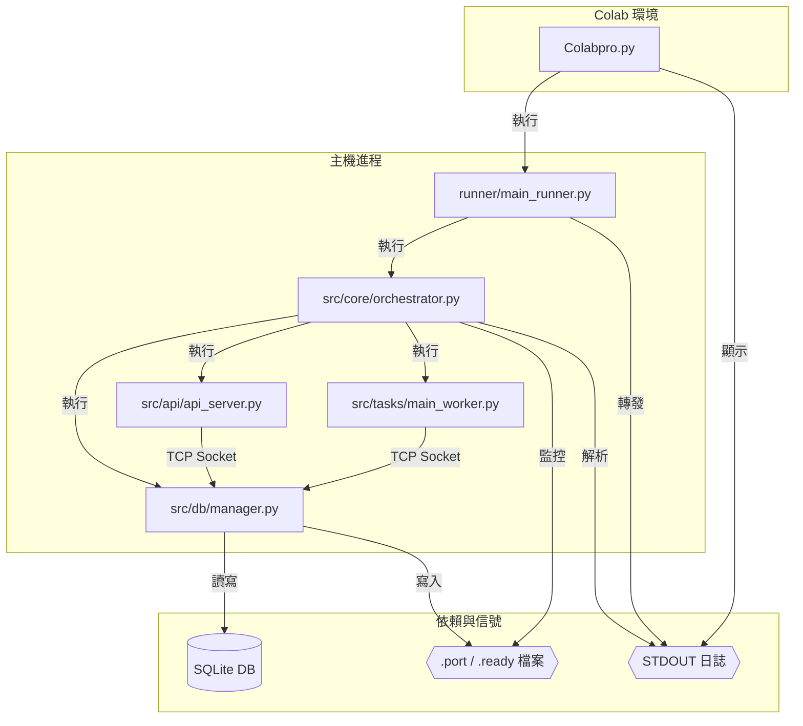

# 系統架構重構計畫書

## 1. 前言

本文件旨在回應目前專案在「啟動流程」、「測試穩定性」與「後端服務架構」上遇到的挑戰。經過深入分析，我們發現問題的根源在於一個過於複雜且脆弱的後端架構。

本計畫將提出一個全新的、以「簡潔、清晰、高效」為核心目標的架構設計，並規劃詳細的實施路徑。

## 2. 現有架構分析

### 2.1 後端架構

目前的後端是一個由多個獨立進程組成的複雜系統，其啟動和協調機制是所有問題的根源。

*   **啟動鏈**：`Colabpro.py` -> `runner/main_runner.py` -> `src/core/orchestrator.py`。
*   **核心 (`orchestrator.py`)**：作為「總司令」，它負責啟動其他所有服務，包括 `db_manager.py`、`api_server.py` 和各類 `worker`。
*   **通信方式**：服務間的同步依賴一套脆弱的混合信號機制：
    1.  **檔案信號**：等待特定 `.port` 和 `.ready` 檔案的出現。
    2.  **網路探測**：輪詢特定埠號是否開啟。
    3.  **日誌解析**：依賴子進程在 `stdout` 中打印特定格式的字串。
*   **資料庫 (`db_manager.py`)**：所有資料庫操作都必須透過一個自製的、單執行緒的 TCP 伺服器 (`db_manager.py`)。這不僅是系統的效能瓶頸，也是一個經典的「反模式」，它導致了用資料庫來模擬任務佇列的低效設計。

#### 現況架構圖 (Mermaid.js)



### 2.2 前端架構

前端採用了現代化的 **Vue 3 + Pinia** 技術棧，架構清晰，狀態管理集中。

*   **狀態管理 (`stores/tasks.js`)**：作為「單一事實來源」，集中管理所有任務狀態、系統負載和日誌。
*   **通信模型**：
    1.  **REST API (axios)**：用於由使用者發起的「寫入」操作（如：上傳檔案、建立任務）。
    2.  **WebSocket**：用於接收由後端主動推送的「讀取」更新（如：任務進度、系統狀態）。

前端的事件驅動模型與新架構的設計目標高度契合，我們將保留其大部分結構。

### 2.3 主要痛點總結

1.  **啟動雜亂且脆弱**：過多的進程和脆弱的信號機制導致啟動緩慢、不穩定且難以除錯。
2.  **測試困難且不可靠**：測試框架 (`conftest.py`) 被迫重複實現了一套複雜的啟動邏輯，與真實世界脫鉤，導致測試不準確、不穩定。
3.  **架構設計不合理**：將 SQLite 包裝成網路服務是核心病灶，導致效能瓶頸，並衍生出用資料庫當佇列、非同步日誌等複雜的「補丁」。

## 3. 新架構設計

### 3.1 設計目標

*   **極簡架構**：大幅減少運行的進程數量和不必要的網路通信。
*   **邊界清晰**：每個組件職責單一。API伺服器只管通信，調度器只管分派，任務腳本只管執行。
*   **前端驅動**：所有工作流程由前端使用者操作觸發，後端被動執行，易於理解和管理。
*   **環境隔離**：每個任務腳本管理自己的虛擬環境，根除依賴衝突。

### 3.2 核心組件

1.  **API 伺服器 (`api_server.py`)**: 一個輕量級的 FastAPI 伺服器。
    *   接收前端指令。
    *   將任務寫入 Redis。
    *   提供前端查詢任務狀態的 API。
2.  **Redis**: 高效的記憶體資料庫。
    *   作為中央「任務板」，儲存待處理的任務。
    *   儲存任務的即時狀態和最終結果。
3.  **中央調度器 (`dispatcher.py`)**: 一個唯一的、持續運行的守護進程。
    *   監聽 Redis 中的新任務。
    *   根據任務類型，**主動執行**對應的任務腳本。
    *   將任務參數透過命令列傳遞給腳本。
4.  **獨立任務腳本 (`tasks/*.py`)**: 一系列單次執行的 `.py` 檔案。
    *   **無監聽、無常駐**：被調度器執行，完成單一任務後即退出。
    *   **自包含環境**：每個腳本內建 `uv venv` 引導邏輯，自動管理自身的虛擬環境和依賴。
    *   從命令列讀取參數，從 Redis 讀取詳細資訊，將結果寫回 Redis。

### 3.3 新架構圖 (Mermaid.js)

```mermaid
graph TD
    subgraph 使用者端
        A[Vue.js 前端]
    end

    subgraph 後端服務
        B[API Server]
        C[中央調度器 Dispatcher]
        D[Redis]
    end

    subgraph 獨立任務 (由 Dispatcher 執行)
        E[tasks/download.py]
        F[tasks/transcribe.py]
        G[...]
    end

    A -- HTTP Request --> B
    B -- LPUSH (新任務) --> D

    C -- BLPOP (等待任務) --> D
    C -- 執行 (帶參數) --> E
    C -- 執行 (帶參數) --> F
    C -- 執行 (帶參數) --> G

    E -- HSET (更新狀態/結果) --> D
    F -- HSET (更新狀態/結果) --> D
    G -- HSET (更新狀態/結果) --> D

    A -- HTTP Poll (查詢狀態) --> B
    B -- HGET (讀取狀態/結果) --> D
```

### 3.4 數據流

1.  **任務創建**: 使用者在前端點擊「開始」 -> 前端發送 HTTP 請求到 **API 伺服器** -> **API 伺服器**將任務訊息 `LPUSH` 到 Redis 的一個 `list` 中（如 `task_queue`）。
2.  **任務調度**: **中央調度器**使用 `BLPOP` 阻塞式地等待 `task_queue` 中的新任務 -> 調度器讀取任務類型，執行對應的**任務腳本** (e.g., `python tasks/download.py --task-id=xyz`)。
3.  **任務執行**: **任務腳本**啟動 -> 根據傳入的 `task-id`，從 Redis 的一個 `hash` 中讀取任務詳情 -> 執行業務邏輯 -> 將進度/結果 `HSET` 回 Redis 中對應 `task-id` 的 `hash` 裡。
4.  **狀態更新**: 前端定期輪詢（`poll`）**API 伺服器**的一個端點（如 `/api/task_status/xyz`） -> **API 伺服器**從 Redis 的 `hash` 中讀取並回傳最新狀態。

## 4. 高層次實施計畫

1.  **環境準備**: 引入 `redis-py` 函式庫，並在 `docker-compose.yml` (如果有的話) 或開發文檔中加入 Redis 服務。
2.  **調度器與任務腳本原型**:
    *   建立 `dispatcher.py` 的基本框架。
    *   將現有的 `run_transcription_worker.py` 改造成第一個獨立任務腳本 `tasks/transcribe.py`，並加入 `uv venv` 引導邏輯。
3.  **API 伺服器改造**: 修改 `/api/transcribe` 端點，使其不再觸發 WebSocket，而是將任務寫入 Redis。新增 `/api/task_status/:id` 端點。
4.  **前端改造**: 修改 `stores/tasks.js`，將 `startTranscription` 的邏輯改為輪詢新的狀態端點。
5.  **端到端測試**: 確保從前端點擊到任務完成的整個流程可以跑通。
6.  **遷移與清理**: 將所有舊的 `worker` 逐一改造成新的獨立任務腳本，並在最後安全地移除 `orchestrator.py`, `db_manager.py`, `log_handler.py` 等舊檔案。

## 5. 風險評估

*   **重構範圍大**: 這是一次傷筋動骨的重構，需要謹慎執行，確保每一步都有對應的測試。
*   **Redis 依賴**: 專案新增了對 Redis 的外部依賴，需要在開發和部署環境中進行配置。
*   **`uv venv` 成熟度**: `uv` 發展迅速，但 `venv` 功能相對較新，可能存在未知的邊界問題，需要在使用中進行驗證。

---
本計畫旨在提供一個清晰、穩健的未來方向。我們相信，雖然短期投入較大，但這次重構將會極大地提升專案的開發效率、穩定性和可維護性。
