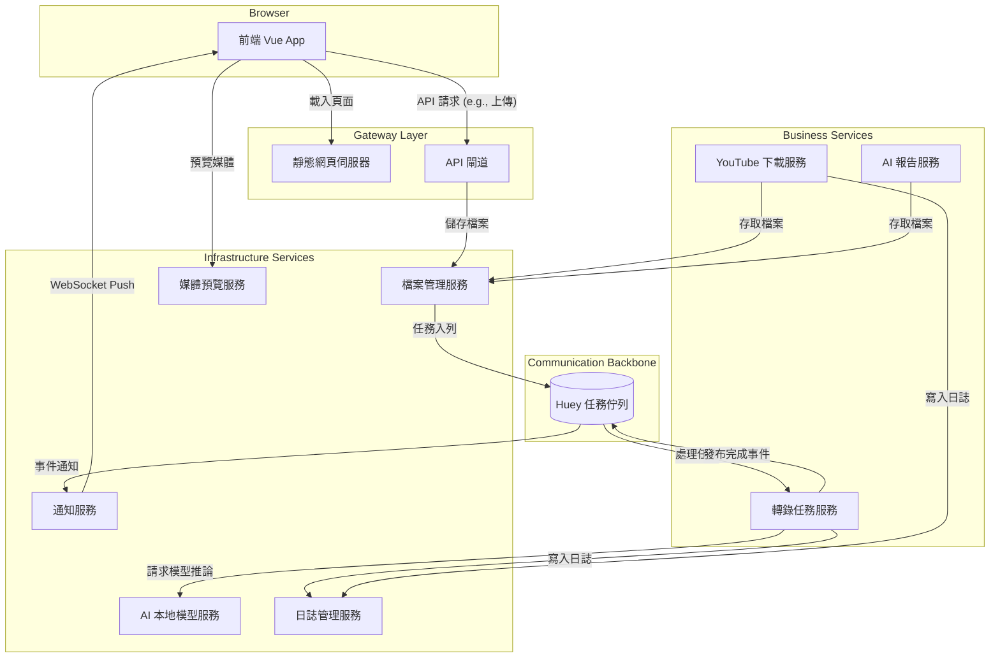

# 後端架構改善研究報告 (v4 - 最終版)

## 1. 目標

本報告旨在回應將現有後端系統改造為「極致解耦的微服務架構」的需求。核心目標是將目前緊密耦合的後端應用，拆分成一系列邊界清晰、職責單一、高內聚、低耦合、可獨立測試和部署的獨立服務。本報告將作為後續所有開發工作的最終指導藍圖。

---

## 2. 核心理念與技術選型

*   **核心理念**: **單一職責原則 (Single Responsibility Principle)**。每個微服務只做一件事，並把它做好。服務之間透過清晰的 API 和非同步訊息進行通訊，而不是直接的程式碼呼叫或共享資料庫。
*   **任務佇列: `huey`**: 一個功能強大且輕量級的 Python 任務佇列函式庫。它原生支援使用 **SQLite** 作為後端儲存，完美符合我們不引入 Redis 等新外部服務也能實現專業級任務佇列的需求。
*   **虛擬環境: `uv`**: 一個用 Rust 編寫的、極速的 Python 套件管理工具。我們將為每個微服務使用 `uv` 來建立和管理其各自的、隔離的 Python 虛擬環境，確保依賴乾淨、啟動快速。

---

## 3. 未來架構規劃：極致解耦的微服務藍圖

### 3.1. 服務職責定義

根據您的要求，我們將系統拆分為以下高度專一化的微服務：

*   **前端服務**:
    *   `靜態網頁伺服器 (Static Web Server)`: 唯一職責是提供 Vue.js 前端應用程式的靜態檔案 (HTML, JS, CSS)。

*   **閘道 (Gateway)**:
    *   `API 閘道 (API Gateway)`: 所有外部 API 請求的統一入口。負責請求的路由、驗證和速率限制，但不包含任何業務邏輯。

*   **核心業務服務 (Business Logic Services)**:
    *   `YouTube 下載服務`: 負責從 YouTube 下載媒體檔案。完成後發布一個「媒體已下載」事件。
    *   `AI 報告服務`: 訂閱「媒體已下載」事件，並使用 Gemini API 對媒體檔案進行分析，產生報告。
    *   `轉錄任務服務`: 協調音訊轉錄的流程。它接收轉錄請求，並將具體的 AI 推論工作委派給「AI 本地模型服務」。

*   **基礎設施/支撐服務 (Infrastructure/Support Services)**:
    *   `AI 本地模型服務`: 封裝並管理所有本地 AI 模型（如 Whisper）。負責模型的下載、快取，並提供推論（Inference）API。此服務將是唯一包含 `torch` 等重度依賴的服務。
    *   `檔案管理服務`: 對伺服器檔案系統的唯一窗口。所有服務需要「儲存」、「讀取」、「重新命名」檔案，都必須透過呼叫此服務的 API 來完成。
    *   `媒體預覽服務`: 專門提供對已儲存媒體檔案的 HTTP 存取（串流播放）。
    *   `日誌管理服務`: 建立一個中央日誌中心，收集、儲存並提供所有其他服務的日誌查詢。
    *   `通知服務`: 專門管理 WebSocket 連線，監聽系統中的各種事件（如「任務完成」），並即時推送給前端。
    *   `任務資料庫服務`: (隱含服務) 為了徹底解耦，所有對任務狀態資料庫的直接操作，都應由一個專門的、簡單的 CRUD 服務來管理。

### 3.2. 未來架構示意圖



---

## 4. 前端整合策略
*(本章節內容與 v3 報告相同，核心思想是在閘道層維持 API 的穩定，讓前端的改動降到最低，只增加處理服務失效的容錯邏輯。)*

---

## 5. 架構對比：優劣勢分析
*(本章節內容與 v3 報告相同，微服務架構在測試性、擴展性、容錯性上有巨大優勢，但在部署和維運複雜度上有所提升。)*

---

## 6. 環境管理方案：整合 UV
*(本章節內容與 v3 報告相同，我們將為每個微服務使用 `uv` 來建立和管理其隔離的 Python 虛擬環境。)*

---

## 7. 未來檔案結構規劃

```
.
├── ... (其他既有檔案)
└── services/
    ├── common/                     # 存放共享的程式碼，如資料庫模型
    ├── huey_config.py              # Huey 的統一設定檔
    ├── api_gateway/
    ├── static_web_server/
    ├── transcription_service/
    ├── youtube_service/
    ├── ai_report_service/
    ├── local_ai_model_service/     # 唯一安裝 torch, faster-whisper 的地方
    ├── file_management_service/
    ├── media_preview_service/
    ├── log_management_service/
    └── notification_service/
```
*(每個服務目錄下都將包含自己的 `main.py` 或 `consumer.py`, `requirements.txt`, 和由 `uv` 管理的 `.venv`)*

---

## 8. 結論

這份最終版的藍圖，詳細規劃了一個高度解耦、職責清晰的微服務架構。它採納了您所有的設計思想，將系統拆分成了一系列簡單、專注的服務。透過 `huey` 和 `uv` 等現代化工具，我們可以在不引入複雜外部依賴的情況下，實現一個健壯、可維護且易於擴展的後端系統。本報告已包含所有必要的規劃細節，可作為後續開發工作的最終指導文件。
