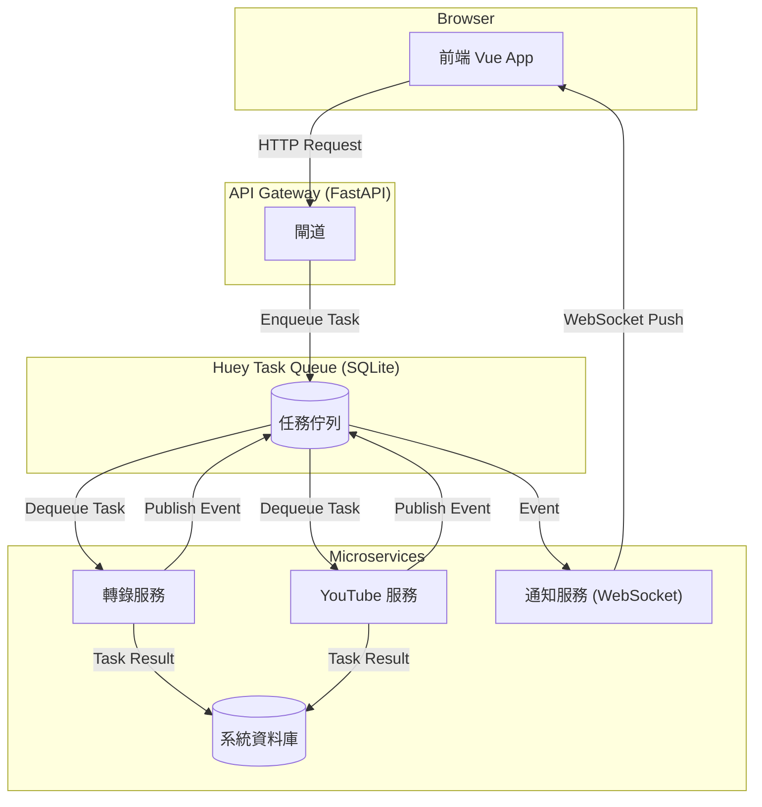

# 後端架構改善研究報告 (v3 - 2025-08-18)

## 1. 目標

本報告旨在回應將現有後端系統改造為「微服務架構」的需求。核心目標是將目前緊密耦合的後端應用，拆分成一系列高內聚、低耦合、可獨立測試和部署的獨立服務，並規劃前端應如何與新架構整合，以實現最高的系統穩定性、可維護性與擴展性。

---

## 2. 現有架構分析

目前的後端系統是一個典型的「雙核心單體式 (Two-Core Monolith)」應用，主要由 `api_server.py` (API 主入口) 和 `worker.py` (背景處理程序) 構成，它們之間透過 SQLite 資料庫進行通訊。前端 `vue-app` 則透過統一的 `/api` 前綴與 `api_server.py` 進行所有通訊。

**核心痛點**:
*   **高度耦合**: 服務間職責不清，修改一個功能可能意外影響其他功能。
*   **測試困難**: 無法單獨測試某個業務邏輯，必須啟動整個後端，測試成本高。
*   **容錯性差**: 任何一個元件的嚴重錯誤都可能導致整個應用程式崩潰。前端無法區分是哪個後端功能失效。
*   **可擴展性差**: 無法針對性地擴展某個特定功能（如轉錄任務）。

---

## 3. 未來架構規劃

為了解決上述痛點，我們建議引入一個專業的任務佇列函式庫 `huey` 作為服務間非同步通訊的核心，並採用 `uv` 來進行現代化的 Python 環境管理。

### 3.1. 核心技術選型

*   **任務佇列: `huey`**: 一個功能強大且輕量級的 Python 任務佇列函式庫。最關鍵的是，**它原生支援使用 SQLite 作為後端儲存**，完美符合我們不引入新的外部服務（如 Redis）也能實現專業級任務佇列的需求。
*   **虛擬環境: `uv`**: 一個用 Rust 編寫的、極速的 Python 套件管理工具。它將取代傳統的 `pip` 和 `venv`，為每個微服務提供快速、可靠且隔離的開發環境。

### 3.2. 未來架構示意圖


---

## 4. 前端整合策略：最小化改動與提升韌性

後端改造的成功關鍵之一，在於前端能以最小的成本平滑過渡，並能利用微服務的優勢提升使用者體驗。

### 4.1. API 請求 (前端無需改動)
*   **策略**: 新的 **API 閘道**將會扮演前端與眾多微服務之間的中介者。它會維持所有現有的 API 路徑（如 `/api/transcribe`, `/api/youtube/process`）不變，並在內部將這些請求透明地路由到對應的微服務。
*   **結論**: 前端現有的 `axios` 請求邏輯**完全不需要修改**。這極大地降低了重構的風險和成本。

### 4.2. WebSocket 通訊 (前端無需改動)
*   **策略**: 新的**通知服務**將會完全複製現有的 WebSocket 功能。它會從所有微服務收集事件，並將其格式化為與**當前完全一致的 JSON 結構**，再透過同樣的 `/api/ws` 路徑推送給前端。
*   **結論**: 前端現有的 WebSocket 連線及訊息處理邏輯**也完全不需要修改**。

### 4.3. 服務容錯與 UI 韌性 (前端唯一需要修改處)
這是本次重構為前端帶來的最大價值：**系統韌性**。
*   **策略**:
    1.  **閘道層**：當 API 閘道發現某個微服務（如「轉錄服務」）無回應時，它不再回傳通用錯誤，而是回傳一個帶有清晰資訊的特定錯誤，例如 `503 Service Unavailable` 並附帶 `{ "service_name": "transcription" }` 的內容。
    2.  **前端狀態管理層**：在 `vue-app/src/stores/tasks.js` 中，我們需要擴充 `axios` 的錯誤處理邏輯，來捕獲這種特定錯誤。並新增一個狀態 `serviceStatus: { transcription: 'online', youtube: 'online' }`。當收到特定服務的錯誤時，更新此狀態，例如 `state.serviceStatus.transcription = 'offline'`。
    3.  **前端 UI 層**：對應的 Vue 元件（如 `TaskUploader.vue`）可以綁定這個狀態。當 `serviceStatus.transcription` 為 `'offline'` 時，元件可以禁用其上傳按鈕，並顯示「轉錄服務暫時不可用」的提示。
*   **結論**: 透過這個改造，即使某個後端服務失效，也只會影響到前端對應的功能區塊（實現您所說的「變灰」效果），而不會導致整個前端應用程式的崩潰。

---

## 5. 架構對比：優劣勢分析

| 特性 | 現有單體式架構 (Monolith) | 未來微服務架構 (Microservices) |
| :--- | :--- | :--- |
| **測試性** | 🔴 **困難**：必須整合整個系統才能測試，一個小改動需要回歸所有功能。 | 🟢 **優秀**：每個服務都可獨立進行單元測試、整合測試，測試目標明確、速度快。|
| **擴展性** | 🔴 **差**：只能對整個應用進行水平擴展，無法針對瓶頸服務（如轉錄）單獨擴展，浪費資源。 | 🟢 **優秀**：可以根據負載，獨立擴展任意一個微服務的實例數量。 |
| **部署** | 🟢 **簡單**：只需部署一個應用程式。 | 🟡 **較複雜**：需要部署多個服務，對自動化部署 (CI/CD) 的要求更高。 |
| **開發效率** | 🔴 **低**：所有開發者都在同一個程式碼庫工作，容易產生衝突，互相等待。 | 🟢 **高**：不同團隊可以並行開發不同的服務，互不干擾，加速迭代。 |
| **容錯性** | 🔴 **差**：任何一個元件的嚴重錯誤都可能導致整個應用程式崩潰。 | 🟢 **好**：一個服務的崩潰通常不會影響其他服務，前端可實現優雅降級。 |
| **技術選型** | 🔴 **單一**：整個應用被鎖定在一種技術棧上。 | 🟢 **靈活**：理論上每個服務都可以選用最適合其業務的技術（雖非本次目標）。 |
| **維運複雜度**| 🟢 **低**：只需監控一個應用。 | 🟡 **高**：需要監控多個服務的狀態、日誌以及它們之間的網路通訊。 |

---

## 6. 環境管理方案：整合 UV

`uv` 是一個現代化的 Python 套件安裝與虛擬環境管理工具，它比 `pip` 和 `venv` 快 10-100 倍。我們將採用 `uv` 來為每個微服務管理其依賴。

**未來工作流程**:
1.  **目錄結構**: 每個微服務目錄（如 `services/transcription_service/`）都將包含自己的 `requirements.txt` 檔案。
2.  **建立環境**: 開發者在進入某個服務的目錄後，只需執行 `uv venv` 即可快速建立一個隔離的虛擬環境 (例如 `.venv`)。
3.  **安裝依賴**: 接著執行 `uv pip install -r requirements.txt`，`uv` 會以極快的速度安裝所有需要的套件。

---

## 7. 未來檔案結構規劃

```
.
├── ... (其他既有檔案)
└── services/
    ├── common/                 # 存放共享的程式碼，如資料庫模型
    │   └── db_models.py
    ├── huey_config.py          # Huey 的統一設定檔
    ├── api_gateway/            # API 閘道服務
    │   ├── main.py
    │   └── requirements.txt
    ├── transcription_service/  # 轉錄服務
    │   ├── .venv/              # 由 uv 管理的虛擬環境
    │   ├── tasks.py            # 定義 Huey 任務 (@huey.task)
    │   ├── consumer.py         # 啟動 Huey consumer
    │   └── requirements.txt
    └── ... (其他服務)
```

---

## 8. 遷移與驗證策略
*(遷移步驟與驗證方法與前版報告相同)*

---

## 9. 結論

將後端重構成為基於 `huey` 的微服務架構，並採用 `uv` 進行現代化的環境管理，是解決當前痛點、實現「高內聚、低耦合」目標的現代化、高效率方案。本報告同時規劃了詳細的前端整合策略，確保在最小化改動的前提下，最大化新架構帶來的系統韌性優勢。建議採納此規劃，作為後續開發的指導藍圖。
